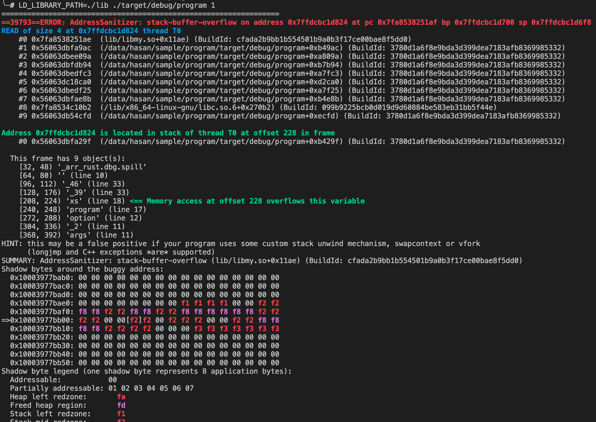
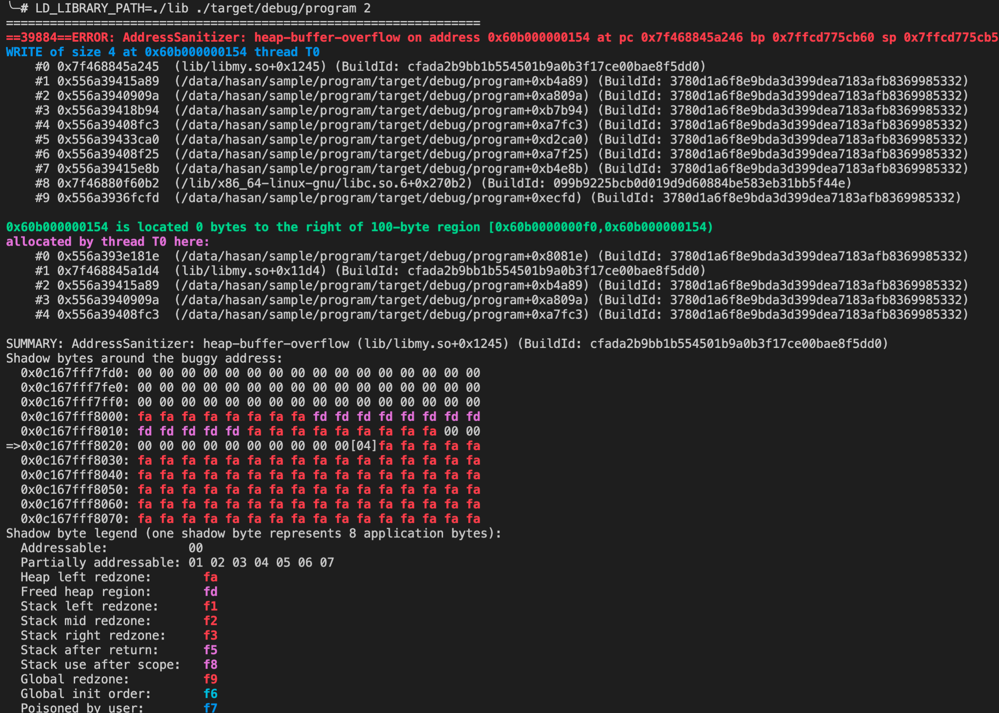
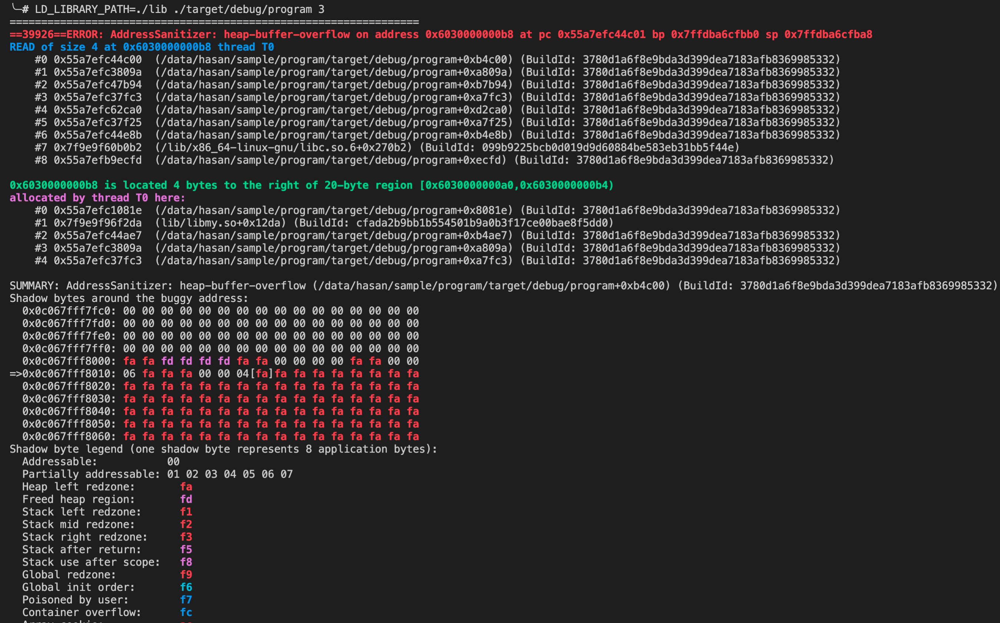

This repo illustrate the how to compile rust program with ASAN that works in hybrid scenario.

## Requirements

* LLVM-10 (installed from package manager, not tested on self compiled version yet)

* Unstable rust

```bash
rustup default nightly
```

## Usage

Check to target branch to see detailed instructions.

[ASAN](https://github.com/mingjun97/hybrid_rust_asan/tree/asan)

## Showcase

### ASAN







